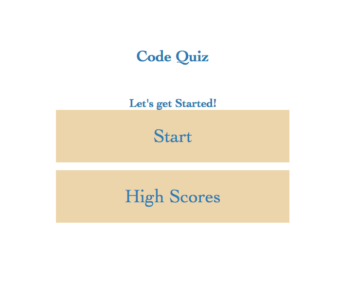
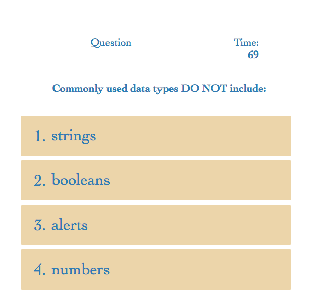
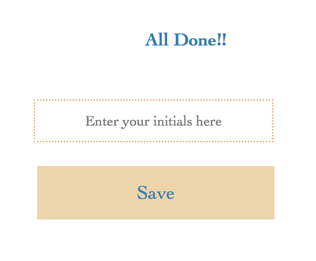

# Code Quiz

Users can brush up on their coing knowledge by taking this quiz. The quiz consists of 5 questions and users have 75 seconds to complete the questions. Quiz is over when the user anwsers all the questions or timer runs out. 

# Instructions 

1. Click "start" to begin the quiz
2. Timer starts as soon as the quiz page is displayed
3. Select an answer for each question (20 seconds gets dedcuted for every incorrect answer)
4. Once finished, enter initials and hit the 'submit' button
5. In the highscores page, view stored scores 
6. Hit the clear button to clear the high scores, and hit the go back button to return to the start of the quiz.

# Webpage Demo

* FSR CODE QUIZ Demo 

# Webpage 
Application URL: https://fasicasr.github.io/fsr-code-quiz/
Github: https://github.com/fasicasr/fsr-code-quiz